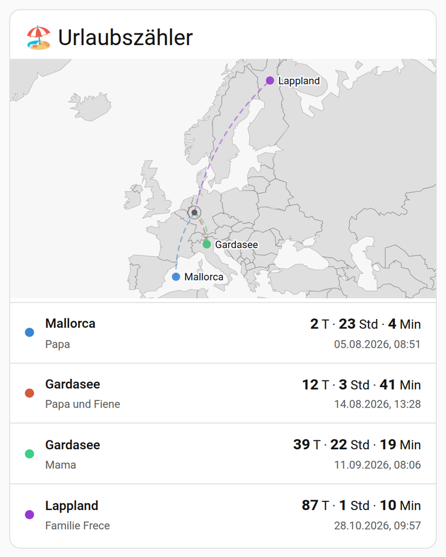
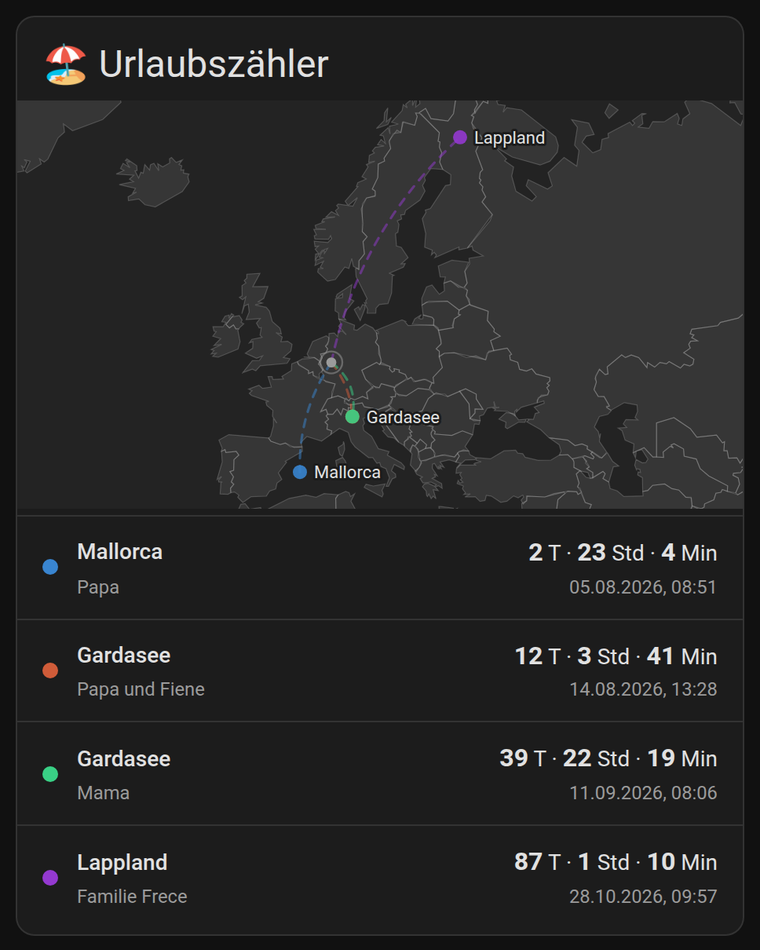
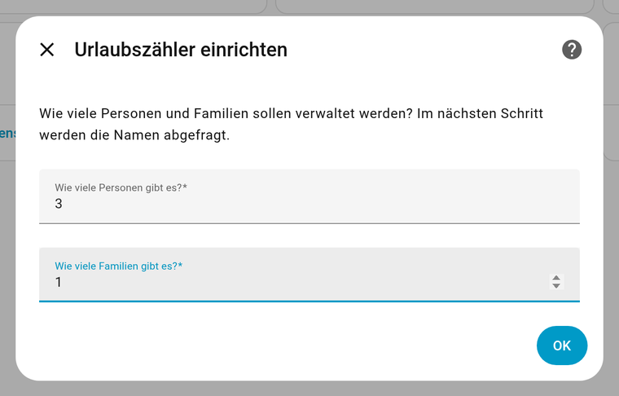
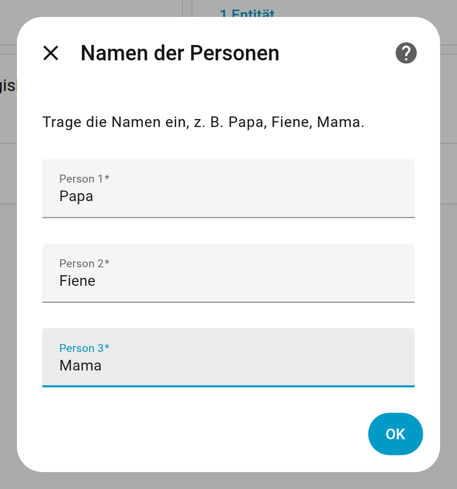
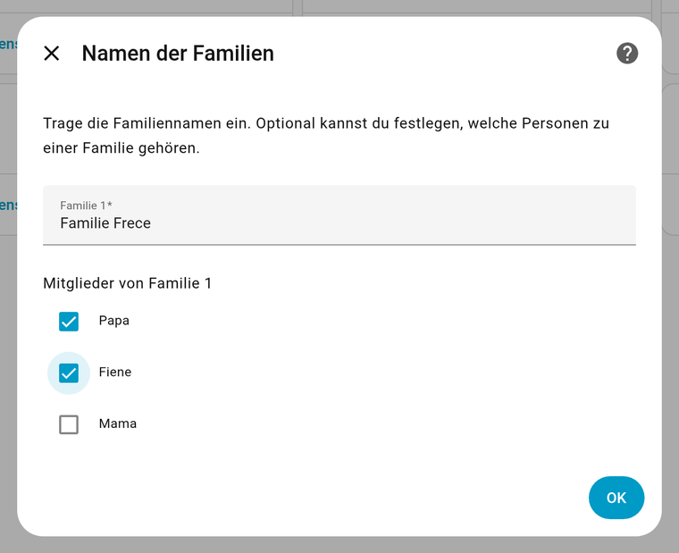
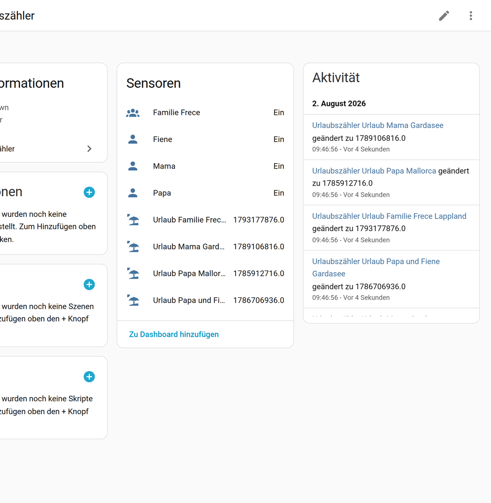
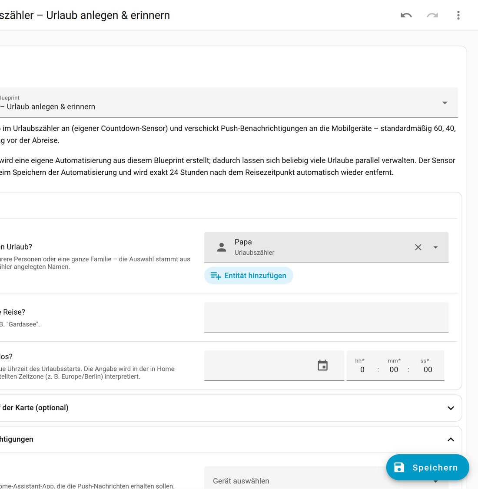
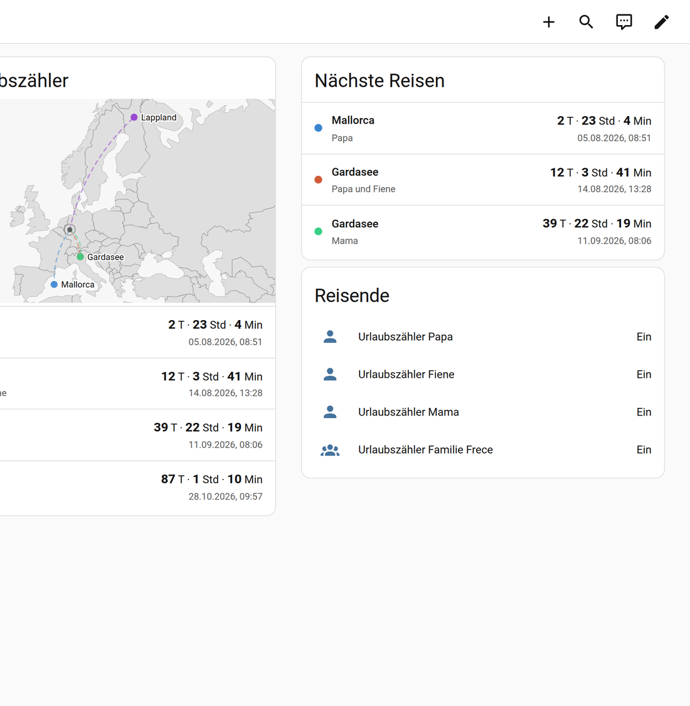

# 🏖️ Urlaubszähler

Zähle die Tage bis zum Urlaub – eine Home-Assistant-Integration, die für jeden
geplanten Urlaub einen eigenen Countdown-Sensor erzeugt, inklusive Blueprint zum
Anlegen neuer Urlaube und für Push-Benachrichtigungen zu festen Vorlaufzeiten.

<p align="center">
  
  
</p>

*Alle Bilder in dieser Anleitung sind echte Aufnahmen aus einer laufenden
Home-Assistant-Instanz (2026.2) mit dieser Integration.*

* Einrichtung komplett über die UI (Config Flow) – **keine Helfer von Hand anlegen**.
  `input_datetime`, `input_text` & Co. sind nicht nötig; die Integration verwaltet
  alle Daten intern in ihrem eigenen Speicher (`.storage/urlaubszaehler.<entry_id>`).
* Beliebig viele Urlaube parallel.
* Countdown stoppt bei `0 Tage, 0 Stunden, 0 Minuten` – es wird nicht negativ
  weitergerechnet.
* Der Sensor wird **exakt 24 Stunden nach dem Reisezeitpunkt** automatisch und
  restlos entfernt (auch aus der Entitäten-Registry).

Mindestversion: **Home Assistant 2024.11**

---

## 1. Wohin gehören die Dateien?

Alles relativ zu deinem Home-Assistant-Konfigurationsverzeichnis (dort, wo auch
die `configuration.yaml` liegt):

```
config/
├── custom_components/
│   └── urlaubszaehler/          ← kompletter Ordner aus diesem Repo
│       ├── __init__.py
│       ├── manifest.json
│       ├── const.py
│       ├── models.py
│       ├── manager.py
│       ├── config_flow.py
│       ├── sensor.py
│       ├── binary_sensor.py
│       ├── services.yaml
│       ├── strings.json
│       └── translations/
│           ├── de.json
│           └── en.json
├── blueprints/
│   └── automation/
│       └── urlaubszaehler/
│           └── urlaub_anlegen.yaml
└── www/
    └── urlaubszaehler-card.js   ← die eigene Lovelace-Karte
```

Die Datei `lovelace/urlaubszaehler_karte.yaml` wird **nicht** kopiert – daraus
fügst du dir nur die gewünschte Karte ins Dashboard ein.

### Installation über HACS (alternativ)

HACS → Integrationen → ⋮ → *Benutzerdefinierte Repositories* → dieses Repository
als Kategorie *Integration* hinzufügen → installieren.

---

## 2. Aktivieren nach dem Neustart

1. Home Assistant **neu starten** (Entwicklerwerkzeuge → Neu starten).
2. **Einstellungen → Geräte & Dienste → Integration hinzufügen** → nach
   `Urlaubszähler` suchen.
3. **Schritt 1:** Anzahl der Personen und Anzahl der Familien eintragen.
4. **Schritt 2:** Namen der Personen eintragen (z. B. `Papa`, `Fiene`).
5. **Schritt 3:** Familiennamen eintragen und optional festlegen, welche
   Personen zu einer Familie gehören.

| Schritt 1 | Schritt 2 | Schritt 3 |
|---|---|---|
|  |  |  |

Danach hängen alle Entitäten an einem gemeinsamen Gerät:



Danach existiert je Person und Familie eine Entität, z. B.
`binary_sensor.urlaubszahler_papa` – diese Namen tauchen im Blueprint zur
Auswahl auf.

> Namen später ändern: **Einstellungen → Geräte & Dienste → Urlaubszähler →
> Konfigurieren**. Dort lassen sich auch geplante Urlaube vorzeitig löschen.

### Blueprint aktivieren

Nach dem Neustart: **Einstellungen → Automatisierungen & Szenen → Blueprints**.
Taucht *„Urlaubszähler – Urlaub anlegen & erinnern"* nicht sofort auf, einmal
über **Entwicklerwerkzeuge → YAML → Blueprints neu laden** aktualisieren.

---

## 3. Einen Urlaub anlegen

**Einstellungen → Automatisierungen → Automatisierung erstellen → Aus Blueprint**
→ *Urlaubszähler – Urlaub anlegen & erinnern*.

| Feld | Bedeutung |
|---|---|
| **Wer fährt in den Urlaub?** | Eine Person, mehrere Personen oder eine ganze Familie |
| **Wohin geht die Reise?** | Freitext, z. B. `Gardasee` |
| **Wann geht es los?** | Datum **und** genaue Uhrzeit |
| **Mobilgeräte** | Geräte mit der HA-App, die Push bekommen |
| **Vorlaufzeiten** | Standard: 60, 40, 20, 10, 5 und 1 Tag vorher |
| **Uhrzeit der Erinnerung** | Standard: 09:00 Uhr |



Beim **Speichern** der Automatisierung wird der Sensor sofort erzeugt. Für jeden
weiteren Urlaub legst du einfach eine weitere Automatisierung aus demselben
Blueprint an.

---

## 4. Der Sensor

Pro Urlaub entsteht eine Entität wie `sensor.urlaubszahler_urlaub_papa_und_fiene_gardasee`.

**Status:** der Reisebeginn als **Unix-Zeit (Dezimal, Sekunden)**. Die Uhrzeit
wird in der in Home Assistant eingestellten Zeitzone (z. B. `Europe/Berlin`)
interpretiert, inklusive Sommer-/Winterzeit. Aus diesem einen Wert lassen sich
Tage, Stunden und Minuten jederzeit exakt ableiten – im Sensor selbst wie auch
in jeder Lovelace-Karte.

**Attribute:**

| Attribut | Beispiel |
|---|---|
| `nachricht` | `Der Urlaub von Papa und Fiene ist in 12 Tagen, 5 Stunden und 42 Minuten. Die Reise geht nach Gardasee.` |
| `wer` / `namen` | `Papa und Fiene` / `["Papa", "Fiene"]` |
| `ziel` | `Gardasee` |
| `start` / `start_zeitstempel` | `2026-08-14T07:30:00+02:00` / `1786764600.0` |
| `tage`, `stunden`, `minuten` | `12`, `5`, `42` (stoppen bei `0`) |
| `verbleibende_sekunden` | `1058520` |
| `gestartet` | `true`, sobald der Reisezeitpunkt erreicht ist |
| `wird_geloescht_am` | `2026-08-15T07:30:00+02:00` |
| `zeitzone` | `Europe/Berlin` |
| `breitengrad` / `laengengrad` | `45.65` / `10.65` (für die Karte, sonst `null`) |
| `koordinaten_quelle` | `geocoding`, `manuell` oder `null` |
| `gefunden_als` | `Lago di Garda, Italia` |

---

## 5. Die Urlaubszähler-Karte fürs Dashboard

Eine eigene Lovelace-Karte liegt unter `www/urlaubszaehler-card.js` bei. Sie
zeigt alle geplanten Urlaube als kompakte Liste und darüber eine Weltkarte:
vom Standort des Home-Assistant-Servers führt zu jedem Reiseziel ein
gestrichelter Bogen. Der Kartenausschnitt richtet sich automatisch nach
Zuhause und allen Zielen; mehrere Reisen zum selben Ort laufen nebeneinander
statt übereinander.

**Einrichten:**

1. `www/urlaubszaehler-card.js` nach `config/www/` kopieren.
2. **Einstellungen → Dashboards → ⋮ → Ressourcen → Ressource hinzufügen**
   * URL: `/local/urlaubszaehler-card.js`
   * Typ: **JavaScript-Modul**
3. Browser einmal hart neu laden (Strg+F5).
4. Dashboard bearbeiten → **Karte hinzufügen** → „Urlaubszähler".

**Optionen** (auch im grafischen Editor der Karte einstellbar):

| Option | Standard | Bedeutung |
|---|---|---|
| `title` | `Urlaubszähler` | Überschrift, leer lassen blendet sie aus |
| `show_map` | `true` | Weltkarte anzeigen |
| `map_height` | `260` | Höhe der Karte in Pixeln |
| `max` | `0` | Höchstzahl angezeigter Urlaube (`0` = alle) |
| `entities` | – | Feste Sensor-Auswahl statt automatischer Erkennung |

```yaml
type: custom:urlaubszaehler-card
title: 🏖️ Urlaubszähler
show_map: true
map_height: 260
```



Ein Klick auf eine Zeile öffnet die Detailansicht des jeweiligen Sensors.
Reiseziele ohne Koordinaten erscheinen in der Liste mit dem Hinweis
„Ort nicht gefunden", aber nicht auf der Karte.

Wer nichts installieren möchte, findet in
[`lovelace/urlaubszaehler_karte.yaml`](lovelace/urlaubszaehler_karte.yaml)
zusätzlich reine Bordmittel-Karten (Markdown).

### Woher kommen die Koordinaten?

Beim Anlegen eines Urlaubs schlägt die Integration den Ortsnamen einmalig bei
**OpenStreetMap/Nominatim** nach und speichert das Ergebnis. Jeder Ort wird nur
einmal abgefragt; weitere Reisen zum selben Ziel nutzen den Zwischenspeicher.
Ist ein Ortsname mehrdeutig oder unbekannt, lässt sich im Blueprint
*„Zielort selbst auf der Karte setzen"* einschalten und der Punkt von Hand
setzen – manuelle Koordinaten haben immer Vorrang.

Ohne Internetverbindung schlägt nur die Ortssuche fehl; der Urlaub wird
trotzdem angelegt und der Countdown läuft normal.

### Karte neu bauen

Die Länderumrisse stammen von [Natural Earth](https://www.naturalearthdata.com/)
(gemeinfrei) und stecken vereinfacht und delta-kodiert (~35 KB) direkt in der
Karte – es werden keine Kartenkacheln von fremden Servern nachgeladen. Nach
Änderungen an `tools/urlaubszaehler-card.src.js`:

```bash
python3 tools/build_card.py
```

---

## 6. Services

| Service | Zweck |
|---|---|
| `urlaubszaehler.add_vacation` | Urlaub anlegen bzw. bei gleicher `urlaub_id` aktualisieren |
| `urlaubszaehler.remove_vacation` | Urlaub und Sensor sofort entfernen |
| `urlaubszaehler.list_vacations` | Alle Urlaube inkl. Restzeit zurückgeben |

```yaml
action: urlaubszaehler.add_vacation
data:
  teilnehmer:
    - binary_sensor.urlaubszahler_papa
    - binary_sensor.urlaubszahler_fiene
  ziel: Gardasee
  start: "2026-08-14 07:30:00"
  urlaub_id: sommerurlaub_2026
```

---

## 7. Tests

Die Integration wird gegen ein echtes Home Assistant getestet
(`pytest-homeassistant-custom-component`):

```bash
python3 -m venv .venv && .venv/bin/pip install homeassistant pytest-homeassistant-custom-component
.venv/bin/python -m pytest
```

Abgedeckt sind unter anderem der vollständige Einrichtungsdialog, die drei
Services, das Auflösen von Teilnehmern, das Zwischenspeichern der Koordinaten,
der Countdown-Stopp bei 0, das Löschen exakt 24 Stunden nach der Abreise
(inklusive Zeitumstellung), der Neustart – und der Blueprint selbst: er wird
von Home Assistant geladen, zu einer echten Automatisierung gemacht und für
jede der sechs Vorlaufzeiten geprüft.

---

## 8. Gut zu wissen

* **Auto-Delete:** Ein Hintergrundtask prüft minütlich; der Sensor verschwindet
  in der Minute, in der `Reisezeitpunkt + 24 h` überschritten wird.
* Löschst du die Automatisierung, bleibt der Sensor bis zum Auto-Delete bestehen.
  Sofort entfernen: **Urlaubszähler → Konfigurieren → Geplante Urlaube entfernen**
  oder `urlaubszaehler.remove_vacation`.
* Push-Nachrichten nutzen `notify.mobile_app_<Gerätename>`. Erscheint kein
  Gerät zur Auswahl, ist die Home-Assistant-App auf dem Handy noch nicht
  eingerichtet.
* Die Benachrichtigungen zählen **ganze Kalendertage** – „60 Tage vorher"
  meldet sich also an dem Tag, der 60 Kalendertage vor dem Abreisedatum liegt.
